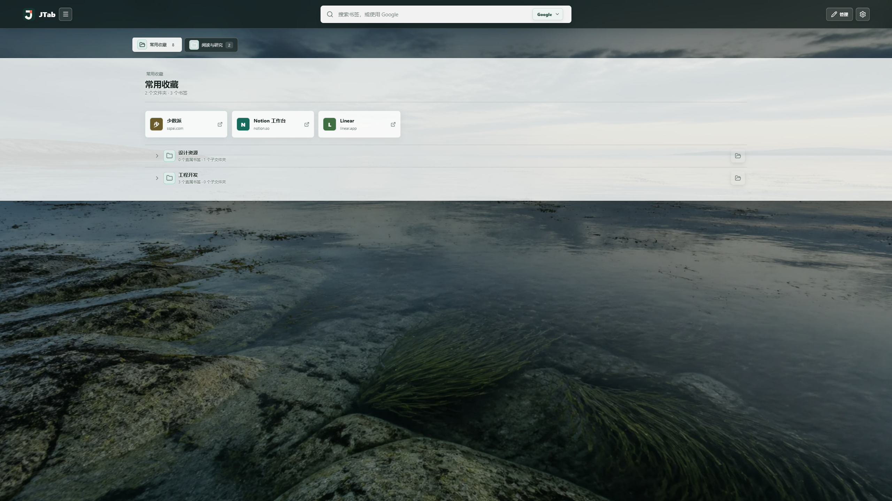
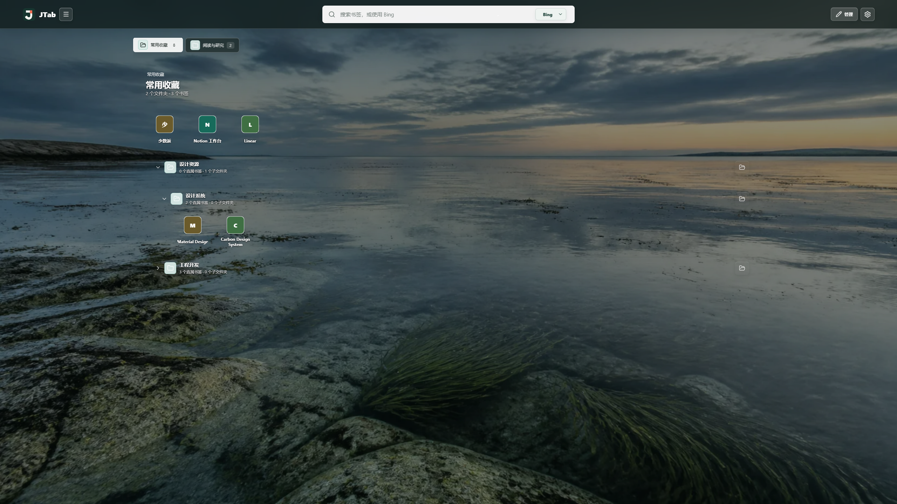
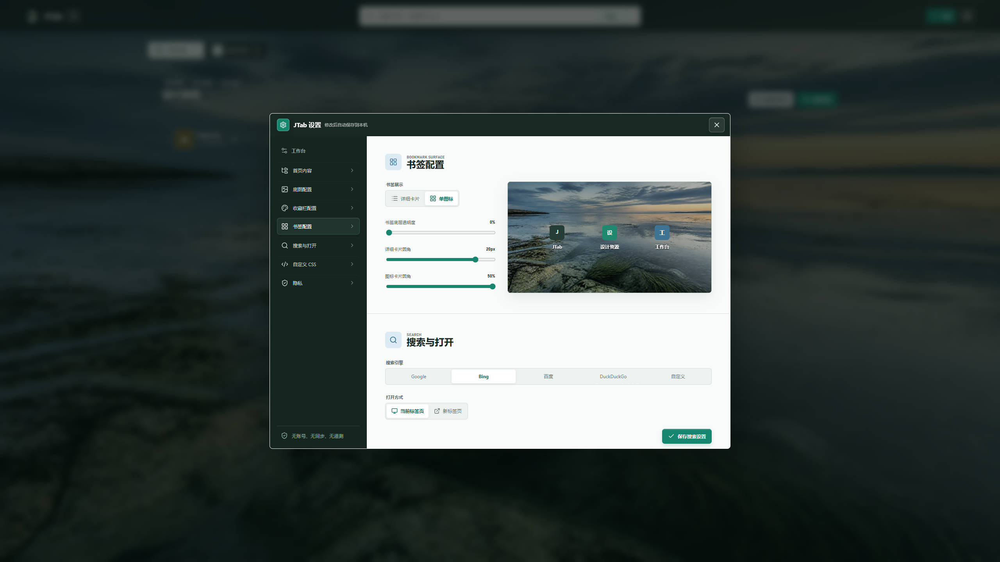

# JTab

JTab 是一款本地优先的书签新标签页扩展，支持 Chrome、Microsoft Edge 和 Firefox。它把浏览器已有书签组织成可浏览、可管理、可自定义的工作台，不需要账号，也不会上传书签或使用行为。

## 预览

<p align="center">
  
  
</p>

<p align="center">
  
</p>

上图为 2560x1440 的项目演示数据截图，分别展示详细卡片、单图标布局和外观设置。截图使用测试书签，不包含用户的个人书签或账户信息。

## 功能

- 选择多个收藏夹作为首页入口，保留独立排序，并可在当前页面展开多层目录。
- 内置书签管理：新建、编辑、移动、删除与拖拽排序均直接作用于浏览器书签。
- 搜索书签或网页，可切换 Google、Bing、百度、DuckDuckGo 与自定义搜索地址。
- 支持详细卡片和单图标两种布局，分别调整收藏栏、书签卡片的透明度、磨砂和圆角。
- 支持内置背景、本地图片、用户主动设置的 HTTPS 背景，以及安全校验后的自定义 CSS。
- Chrome 和 Edge 使用浏览器本地 favicon；Firefox 使用本地图片或离线文字字标兜底。

## 隐私与权限

JTab 没有账号、云同步、广告、分析或遥测。书签、设置与本地图片均留在当前浏览器配置文件中。

| 浏览器        | 构建目标      | 权限                              |
| ------------- | ------------- | --------------------------------- |
| Chrome / Edge | `chrome-mv3`  | `bookmarks`、`storage`、`favicon` |
| Firefox 140+  | `firefox-mv3` | `bookmarks`、`storage`            |

`favicon` 仅访问 Chromium 浏览器已有的本地 `_favicon` 资源。JTab 不请求网站 `/favicon.ico`，不使用第三方图标服务，也不申请主机权限、`tabs`、`tabGroups`、内容脚本或可选权限。

完整数据处理说明见 [隐私声明](./PRIVACY.md)。

## 自定义 CSS

自定义 CSS 在新标签页设置中启用，并在主题层之后生效。可用变量、稳定选择器、示例与安全边界见 [自定义 CSS 指南](./docs/CUSTOM_CSS.md)。

```css
.jtab-shell {
  --jtab-content-opacity: 0.7;
  --jtab-content-blur: 12px;
  --jtab-bookmark-detail-card-radius: 14px;
}
```

自定义 CSS 最大为 100 KB，禁止 `@import` 和远程 URL。若样式导致设置入口不可用，可从浏览器扩展详情页打开“扩展程序选项”恢复或重置；该页面不会加载用户 CSS。

## 开发

环境要求：Node.js 22 或更高版本、pnpm 10。

```powershell
pnpm install --frozen-lockfile
pnpm dev
pnpm dev:firefox
```

构建并验证：

```powershell
pnpm verify
pnpm zip:all
```

- `.output/chrome-mv3`：Chrome 与 Edge 的解压扩展。
- `.output/firefox-mv3`：Firefox MV3 的解压扩展。
- `.output/jtab-<version>-*.zip`：商店与 Firefox 源码审核包。

本地加载：Chrome 打开 `chrome://extensions`、Edge 打开 `edge://extensions`，启用开发人员模式后加载 `.output/chrome-mv3`；Firefox 在 `about:debugging#/runtime/this-firefox` 加载 `.output/firefox-mv3/manifest.json`。

## 文档

- [自定义 CSS 指南](./docs/CUSTOM_CSS.md)：公开样式接口、选择器、示例与限制。
- [发布指南](./docs/PUBLISHING.md)：GitHub Release、Chrome、Edge 与 Firefox 上架流程。
- [商店中文描述](./docs/STORE_LISTING.zh-CN.md) 与 [英文描述](./docs/STORE_LISTING.en-US.md)。
- [隐私声明](./PRIVACY.md)：数据处理与权限说明。

## 质量检查

`pnpm verify` 依次执行 WXT 类型生成、TypeScript、ESLint、单元测试、隐私契约、Chrome/Firefox 构建、Manifest 边界检查和 Firefox 商店 lint。`pnpm zip:all` 还会验证商店 ZIP 与源码审核包可从源码逐文件复现。

## 授权

当前仓库尚未声明开源许可证。公开源码不等同于授予使用、修改或再分发许可；在接受外部贡献或分发前，请由版权持有人补充适用许可证。
